  
   

  

  
  

 

  <strong>Aarjav Shukla</strong> · aarjav-shukla 
  <strong>Full Stack Developer</strong> · full-stack applications & contributing to open-source ecosystems  
 Full-Stack Development • REST APIs • Databases • Git • Open Source 
  B.Tech Computer Science · Indian Institute of Information Technology · Class of 2029 
  <em>Ambitious open-source initiatives, developer infrastructure & scalable web systems</em> 

 

  

  

 

 
